# Sales Performance Analysis — End-to-End Power BI Report

**Synthetic enterprise data → Power Query star schema → 79 documented DAX measures → an 11-page decision system**

[](https://powerbi.microsoft.com)
[](https://learn.microsoft.com/dax/)
[](https://learn.microsoft.com/powerquery-m/)
[](https://learn.microsoft.com/analysis-services/tmdl/tmdl-overview)
[](https://learn.microsoft.com/power-bi/developer/projects/projects-overview)
[](#1--the-problem)
[](#contents)

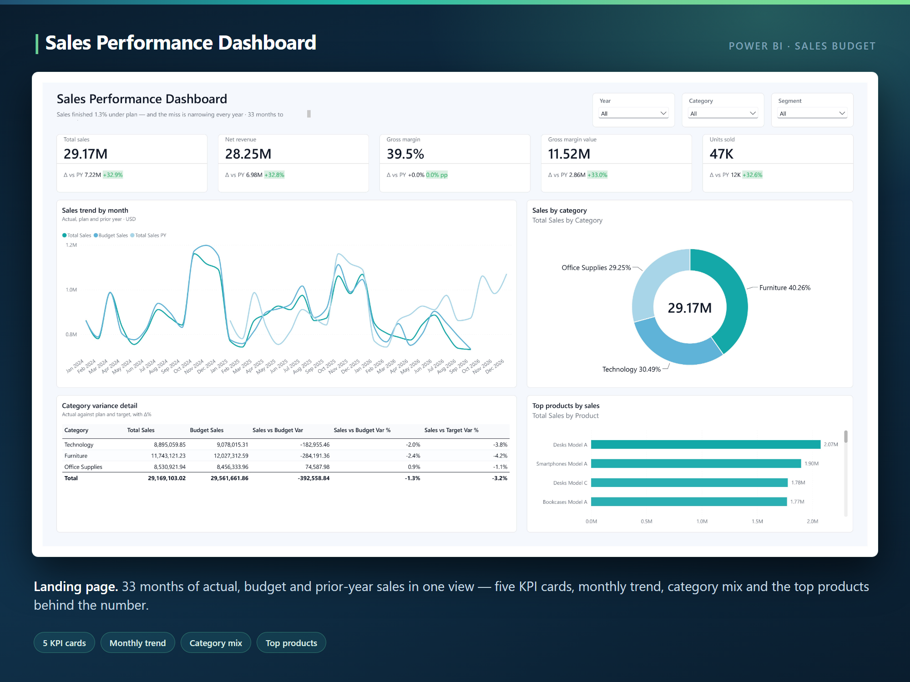

> ### The finding that mattered
>
> **The business misses plan by only −1.3% in total — a rounding error that hides three different
> stories.** Furniture −2.4%, Technology −2.0%, Office Supplies +0.9%. The total looks like noise;
> the decomposition is the decision.

### At a glance

| | | | |
|---|---|---|---|
| **11** report pages | **129** visuals | **79** DAX measures | **14** tables |
| **4** fact tables | **6** dimensions | **11** relationships, all single-direction | **0** bidirectional filters |
| **33** months of actuals (Jan 2024 – Sep 2026) | **10** core analysis types | **PBIP / PBIR / TMDL** — all plain text | **1** parameter repoints every table |

### What this demonstrates

**Data engineering**  `Power Query (M)` `parameterised source` `typed CSV ingestion` `professional renames` `keys hidden` `source-level rescaling`

**Dimensional modelling**  `galaxy schema` `conformed dimensions` `single-direction only` `account dimension with sign modifier` `explicit date table` `auto date/time disabled`

**DAX**  `79 measures` `measure-on-measure variance` `measure-on-measure variance` `RANKX + SUMX Pareto` `context transition` `anchored rolling windows` `z-scores in pure DAX` `DIVIDE discipline`

**Report design**  `Fluent2 base theme` `Teal/Clean palette` `literal hex accents` `polarity-aware variance badges` `field parameters` `1920×1080 canvas`

**Engineering practice**  `PBIP / PBIR / TMDL` `Git-diffable` `description + format string on every measure` `numbered display folders` `one-line source repoint`

**The same thing in prose**

The interesting part of this project is not that it produced an eleven-page dashboard. It is that
the report covers ten genuinely different analytical patterns — variance, trend, scenario,
segmentation, ranking, P&L, quadrant, field parameters, forecast accuracy and outlier detection —
on **one** model, without a single bidirectional filter or disconnected-table hack to make any of
them work. Every benchmark (budget, target, prior year) is a derived measure rather than a
duplicated column, so a number can never disagree with itself across pages.

### Contents

1. **[The problem](#1--the-problem)** — ten analysis types, one model, and why the flat-table shortcut fails
2. **[Tools](#2--tools)** — what each layer is built with, and why the format matters
3. **[Architecture](#3--architecture)** — the pipeline from CSV seed files to a finished page
4. **[Transformations](#4--transformations)** — the Power Query decisions that fix every number downstream
5. **[The model](#5--the-model)** — four facts, six dimensions, eleven single-direction relationships
6. **[The measures](#6--the-measures)** — 79 of them, and the five patterns worth stealing
7. **[Design system](#7--design-system)** — one token contract, one palette, no stray colours
8. **[The dashboard](#8--the-dashboard)** — all eleven pages, one question each
9. **[Findings](#9--findings)** — what the data says, and what to do about it

---

## 1 · The problem

Most Power BI portfolios start where the interesting work ends: a clean table dropped into a chart.
This project starts earlier, with a written brief demanding **ten core analysis types** on a single
enterprise model:

| # | Analysis type | Delivered on |
|---|---|---|
| 1 | Variance analysis (actual vs budget / target / prior year) | Variance Analysis |
| 2 | Time series & trend (rolling averages, dynamic periods) | Time Series & Trend |
| 3 | Scenario comparison (actual / budget / forecast / PY) | Scenario Comparison |
| 4 | Customer & product segmentation | Segmentation |
| 5 | Ranking & categorisation (Top-N, Pareto 80/20) | Ranking & Pareto |
| 6 | Financial reporting structure (P&L with sign flipping) | P&L Statement |
| 7 | Quadrant & matrix portfolio analysis | Portfolio Quadrant |
| 8 | Dynamic field-parameter analytics | Dynamic Field Parameters |
| 9 | Predictive & forecast tracking | Forecast Tracking |
| 10 | Tabular grid views with outlier detection | Grid & Outlier Detection |

The constraint that makes all ten coexist: a **star/galaxy schema** — multiple fact tables sharing
conformed dimensions, so every analysis filters the same way and no page needs its own private
join trick.

> **About the data.** The source is seven synthetic CSVs generated by a seeded Python script
> (`pandas` / `numpy` / `faker`), with deliberate seasonality, realistic budget/target variance and
> 100% referential integrity — zero orphan keys. No client or proprietary data is involved. The
> CSVs are not committed to this repository; see [Running it](#running-it).

## 2 · Tools

| Layer | Tool | Job |
|---|---|---|
| Source | **Python seed script** | Generates the seven CSVs — dates, products, customers, accounts, sales, budget, targets |
| Ingestion + transform | **Power Query (M)** | Reads through one text parameter, types every column, hides keys, renames to business language |
| Modelling | **TMDL** | 14 tables and 11 relationships as plain, diffable text — one file per table |
| Semantic layer | **DAX** | 79 measures on a single measures-only table, each with a description and a format string |
| Report layer | **PBIR** | Eleven pages, 129 visuals, one JSON file per visual |
| Project format | **PBIP** | Makes the whole report reviewable in Git |
| Design | Theme JSON + `TOKENS.md` | Fluent2 base, Teal/Clean palette, literal hex accents |

> **Why the format matters:** a `.pbix` is a binary zip you cannot diff, review or explain. In this
> project a measure change shows up in a pull request as three changed lines, not
> `binary file modified`.

## 3 · Architecture

```
seed CSVs (7 files, synthetic, seasonality + realistic variance)
        │  Power Query — reads through the pSeedDataFolder parameter
        ▼
┌────────────────────────  semantic model (TMDL)  ────────────────────────┐
│  Fact Sales   Fact Budget   Fact Target   Fact Financials               │
│       └────────────┬─────────────┴──────────────┘                       │
│  Dim Date · Dim Product · Dim Customer · Dim Category · Dim Scenario    │
│  Dim Financial Accounts          11 relationships — all single direction│
│                    _Measures — 79 DAX measures, 11 numbered folders     │
│                    3 field-parameter tables (metric / dimension / top-N)│
└────────────────────────────────┬────────────────────────────────────────┘
                                 ▼
        PBIR report — 11 pages · 129 visuals · one JSON per visual
```

Each layer owns exactly one job. Power Query owns shapes and types, the model owns relationships,
DAX owns logic, and the report layer owns nothing but presentation — no cleaning and no hidden
calculations in a visual's filters.

## 4 · Transformations

### 1 · One parameter, seven tables

Every table loads through `pSeedDataFolder` — a Power Query text parameter. Moving the source is a
single-value change, not a walk through nine queries:

```
expression pSeedDataFolder = "H:\Data Analyst\Core Analysis Portfolio\seed_data" meta [IsParameterQuery=true, Type="Text", IsParameterQueryRequired=true]
```

### 2 · Typed and renamed at load

Columns are cast explicitly and renamed to business language (`SalesAmount` → `Sales Amount`,
`BudgetAmount` → `Budget Amount`), surrogate keys are hidden, and sort-by columns are set so months
sort chronologically. Nothing downstream has to remember a naming convention.

### 3 · Auto date/time disabled, one explicit date table

`__PBI_TimeIntelligenceEnabled = 0` — the model has exactly **one** date dimension, marked as the
date table, covering 2024-01-01 → 2026-12-31 with working-day, month, quarter and year attributes.
No hidden auto-generated date tables, no ambiguous filter paths.

### 4 · The plan was rescaled at the source, not in DAX

The original synthetic budget produced variances of **+1251%** — technically valid, analytically
useless. The fix went into the generator, not into a clamping measure: budget and target were
rescaled at the root, producing a realistic **−1.3%** overall plan variance with meaningful
category-level spread. Variance analysis is only credible when the plan itself is credible.

## 5 · The model

Four fact tables, six conformed dimensions, eleven relationships — **every one of them
many-to-one, single-direction**. There is no bidirectional cross-filter anywhere in the model, so
no visual can silently change another.

**Relationships**

| From | To | Cardinality | Direction |
|---|---|---|---|
| `Fact Sales[Date Key]` | `Dim Date[Date Key]` | many : 1 | Single |
| `Fact Sales[Customer Key]` | `Dim Customer[Customer Key]` | many : 1 | Single |
| `Fact Sales[Product Key]` | `Dim Product[Product Key]` | many : 1 | Single |
| `Fact Budget[Date Key]` | `Dim Date[Date Key]` | many : 1 | Single |
| `Fact Budget[Category]` | `Dim Category[Category]` | many : 1 | Single |
| `Fact Target[Date Key]` | `Dim Date[Date Key]` | many : 1 | Single |
| `Fact Target[Category]` | `Dim Category[Category]` | many : 1 | Single |
| `Fact Target[Scenario]` | `Dim Scenario[Scenario]` | many : 1 | Single |
| `Fact Financials[Date Key]` | `Dim Date[Date Key]` | many : 1 | Single |
| `Fact Financials[Account Key]` | `Dim Financial Accounts[Account Key]` | many : 1 | Single |
| `Dim Product[Category]` | `Dim Category[Category]` | many : 1 | Single |

**Three decisions worth naming:**

- **`Dim Category` is conformed, not derived.** Sales reach category through `Dim Product →
  Dim Category`; budget and target connect directly. Actual and plan therefore meet on one shared
  dimension — no many-to-many join, no ambiguous path — which is what makes the variance matrix on
  page 2 trustworthy.
- **Scenario is a dimension, not a `SWITCH`.** `Fact Target` carries a real `Scenario` column
  related to `Dim Scenario`, so conservative/base/optimistic filtering composes normally with date,
  category and product instead of fighting a disconnected table.
- **Signs live in the dimension.** `Dim Financial Accounts` carries a `Sign Modifier` (+1 / −1) and
  a `Sort Order`, so the P&L flips itself and adding a new line needs no new measure.

## 6 · The measures

All **79 measures** live on one measures-only table (`_Measures`, its placeholder column hidden),
organised into numbered display folders — `1. Base Measures` · `2. Variance` · `3. Time
Intelligence` · `4. Scenario` · `4. Advanced` · `5. Segmentation` · `6. Ranking & Pareto` ·
`7. P&L` · `8. Portfolio` · `9. Forecast` · `10. Outliers` — and **every measure carries a
description and a format string**.

**Five patterns worth stealing**

**1 · Benchmark everything as measures.** Budget, target and prior year are derived, never
duplicated columns — so they can never disagree with the pages that also show them.

```dax
Budget Sales      = SUM ( 'Fact Budget'[Budget Amount] )
Sales vs Budget Var = [Total Sales] - [Budget Sales]
Budget Attainment % = DIVIDE ( [Total Sales], [Budget Sales] )   // 100% = exactly on plan
```

`DIVIDE` throughout instead of `/`, so a zero denominator returns blank rather than an error.

**2 · Rolling windows anchored on real data.** The classic DAX trap: a rolling average evaluated at
grand-total level, where the date table runs past the last sale. These anchor on the last date that
actually has sales:

```dax
Rolling 3M Avg Total Sales =
VAR Anchor = CALCULATE ( MAX ( 'Dim Date'[Date] ), 'Fact Sales' )
RETURN
    CALCULATE ( [Total Sales],
        DATESINPERIOD ( 'Dim Date'[Date], Anchor, -3, MONTH ) )
```

**3 · Pareto that survives filter context.** `RANKX` over `ALLSELECTED` respects the visual's
filter; the running total uses `SUMX` — not a bare `CALCULATE` — precisely so the rank comparison
is evaluated per product:

```dax
Product Sales Rank =
    RANKX ( ALLSELECTED ( 'Dim Product'[Product Name] ), [Total Sales], , DESC, DENSE )

Product Cumulative % =
VAR CurrentRank = [Product Sales Rank]
VAR Running =
    SUMX ( FILTER ( ALLSELECTED ( 'Dim Product'[Product Name] ),
                    [Product Sales Rank] <= CurrentRank ),
           [Total Sales] )
RETURN DIVIDE ( Running, [Total Sales] )
```

**4 · IBCS P&L via context transition.** `SUMX` walks the account dimension, `CALCULATE` supplies
the context transition, and the `Sign Modifier` column does the flipping:

```dax
P&L Amount =
SUMX ( 'Dim Financial Accounts',
       CALCULATE ( SUM ( 'Fact Financials'[Amount] ) )
           * 'Dim Financial Accounts'[Sign Modifier] )
```

Variance against prior year divides by `ABS([P&L Amount PY])` — without the `ABS`, every cost line
reports its variance in the wrong direction.

**5 · Statistics that are blank-safe.** The outlier z-score computes population standard deviation
directly in DAX and refuses to score an empty month — an empty month is not an outlier, it is
empty:

```dax
Monthly Sales Z-Score =
VAR Months  = SUMMARIZE ( 'Dim Date', 'Dim Date'[Year Month] )
VAR Mean    = AVERAGEX ( Months, [Total Sales] )
VAR StdDev  = SQRT ( AVERAGEX ( Months, ( [Total Sales] - Mean ) ^ 2 ) )
RETURN
    IF ( NOT ISBLANK ( [Total Sales] ),
         DIVIDE ( [Total Sales] - Mean, StdDev ) )
```

Forecast accuracy is bounded the same way — `MAX(0, 1 - ABS(DIVIDE(...)))` so a large miss cannot
produce a negative reading, and blank-guarded so months without a target do not report 0%.

## 7 · Design system

One token contract, defined once in `TOKENS.md`, referenced by every visual:

| Token | Value | Use |
|---|---|---|
| Base theme | `Fluent2-CY26SU08` | `report.json` baseTheme |
| Accent | `#1FB6A6` | primary series — bars, lines, main values |
| Accent dark | `#12897D` | second series in the same chart |
| Accent light | `#6FCF97` | third / comparison series |
| Positive | `#27AE60` | variance badge — good |
| Negative | `#EB5757` | variance badge — bad |
| Title text | `#2D3436` | page titles on the light canvas |
| Border radius | `10px` | cards |

Two rules that prevent the classic theme bugs: **accents are literal hex, never `ThemeDataColor`**
(a `ColorId` resolves against the base theme and silently renders the wrong colour), and **variance
badges carry polarity** — margin-rate moves are expressed in percentage points with a ` pp` suffix,
so a `0.0 pp` delta is never confused with a relative percentage change.

## 8 · The dashboard

Eleven pages, 129 visuals, one question each. **Year · Category** slicers run throughout; every
number cross-filters.

### 1 · Sales Performance Dashboard


> **"Are we up or down — and against what?"**

Five headline KPIs — total sales, net revenue, gross margin, margin value, units — each carrying a
prior-year delta badge that knows whether the movement is good or bad (`+32.9%` rendered from a
signed `+0.0%;-0.0%;0.0%` format string, not string concatenation). Below: 33 months of actuals
against budget and prior year on one axis, category mix, a variance matrix and top products.

`SAMEPERIODLASTYEAR` PY family · `DIVIDE` discipline · `ALLSELECTED` share-of-selection ·
five-second executive answer

### 2 · Variance Analysis

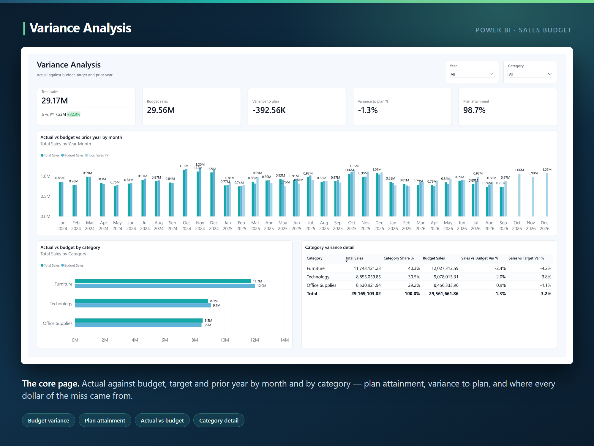

> **"How far off plan are we, and which category produced the miss?"**

Actual against budget, target and prior year — monthly, by category and in total, with plan
attainment as the headline. The attribution matrix resolves the −1.3% total into Furniture −2.4%,
Technology −2.0% and Office Supplies +0.9%, so the reader knows where to act.

`Budget Attainment %` · `Target Sales` isolating the Base scenario via `CALCULATE` · two
benchmarks from two tables meeting on one conformed dimension

### 3 · Time Series & Trend

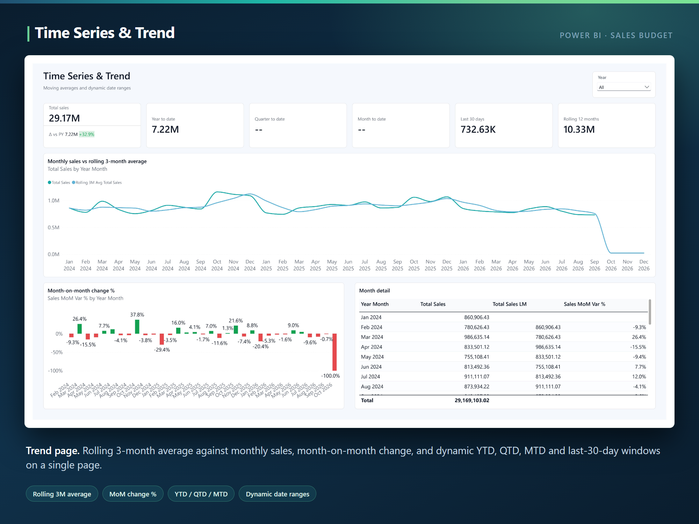

> **"Is this month a dip, or part of a trend?"**

A rolling three-month average over monthly sales, signed month-on-month bars, a month detail table
and six dynamic period cards — total, YTD, QTD, MTD, last 30 days and rolling 12 months.

Windows pinned to the last date with sales via `DATESINPERIOD` · divisor counted from months
present, not assumed to be 3 · the grand-total trap handled

### 4 · Scenario Comparison

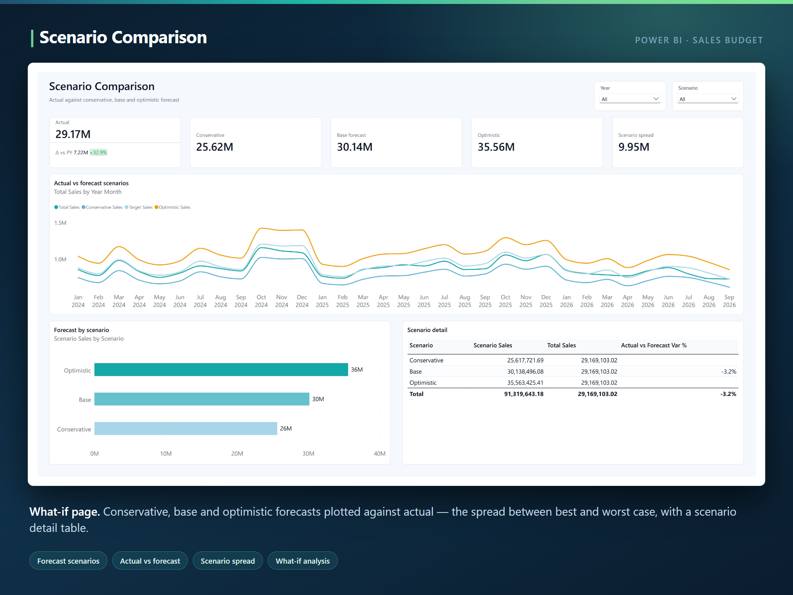

> **"How wide is our planning range, and where are we sitting inside it?"**

Conservative, base and optimistic forecasts against actuals on one timeline, the spread quantified
as a single KPI, each scenario ranked by total.

Scenario as a conformed dimension, not a disconnected `SWITCH` · `Scenario Spread` = optimistic −
conservative (a measure built from two other measures)

### 5 · Segmentation

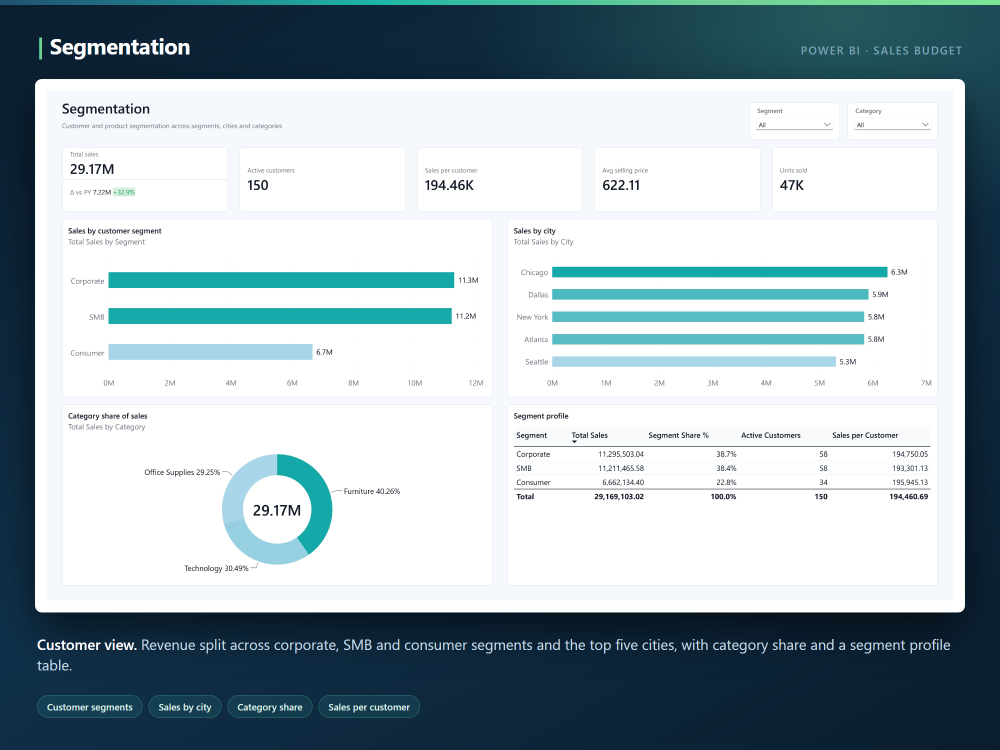

> **"Which customers, in which cities, buying which categories?"**

Revenue across corporate / SMB / consumer, top cities, category share, and a segment profile table
with revenue, share, active customers and revenue per customer side by side.

`DISTINCTCOUNT` active customers · ratio measures that stay correct under any slicer · shares
denominated on `ALLSELECTED` so they always total 100% of the selection

### 6 · Ranking & Pareto

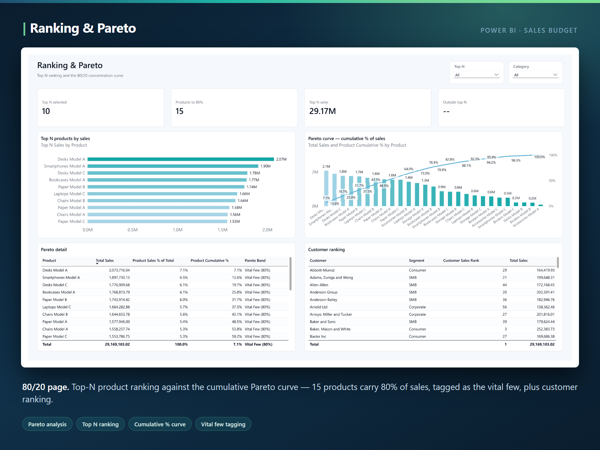

> **"Which products actually matter?"**

Dynamic Top-N ranking against a cumulative Pareto curve, every product tagged **Vital Few (80%)** or
**Useful Many (20%)** — 15 products carry 80% of sales — with a customer ranking mirroring the same
logic. A Top-N slicer drives the page; the cut-off changes without editing a measure.

`RANKX(ALLSELECTED(...))` · the `SUMX`-over-`FILTER` running total · `SWITCH(TRUE(), ...)` banding

### 7 · P&L Statement

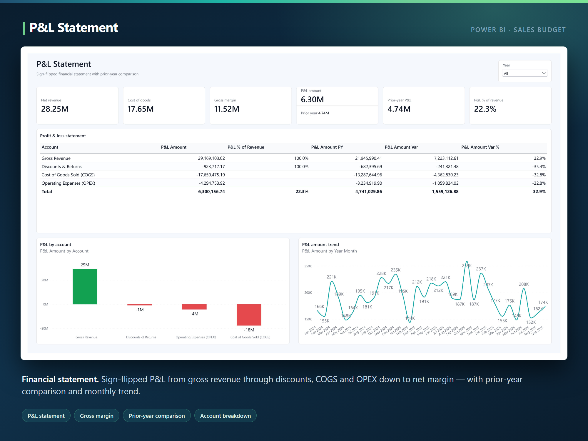

> **"What did we actually keep?"**

An IBCS-style sign-flipped statement: gross revenue positive, discounts, COGS and OPEX flipped
negative, flowing to a net P&L of **6.30M — 22.3% of revenue** — with a prior-year column, a
common-size % of revenue column, a waterfall-style account chart and a monthly trend.

Signs in the dimension via `Sign Modifier` · `ABS` in the variance denominator · new P&L lines need
zero new measures

### 8 · Portfolio Quadrant

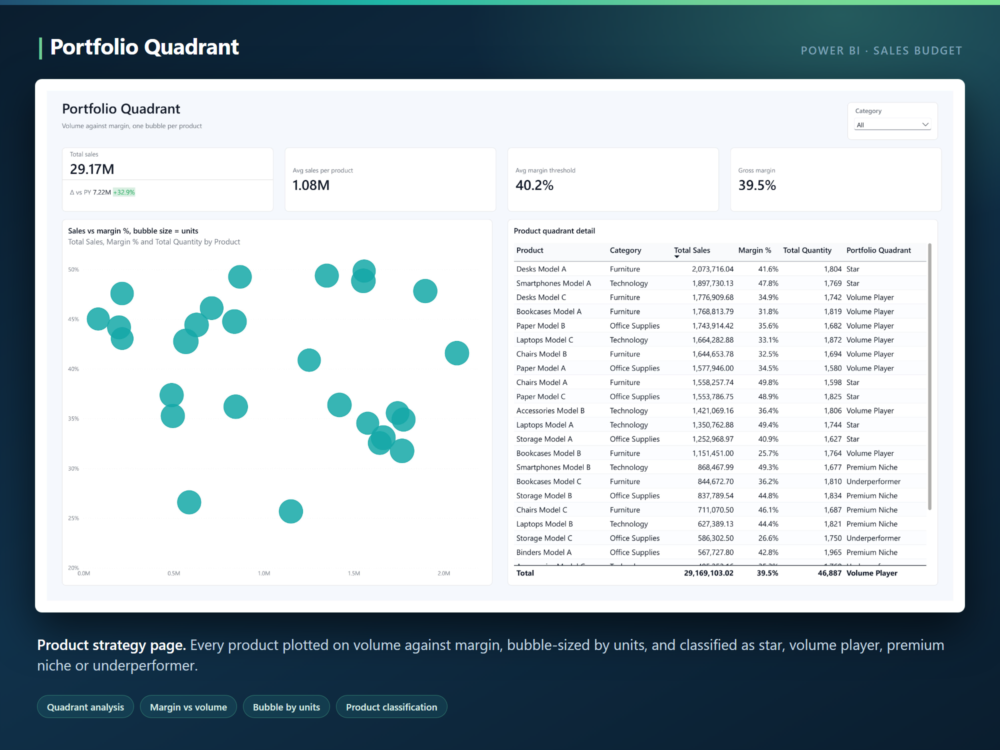

> **"Which products to defend, which to milk, which to drop?"**

Volume against margin, one bubble per product sized by units, classified Star / Volume Player /
Premium Niche / Underperformer against global average thresholds, with the full classification
table alongside.

The deliberate `ALL` (not `ALLSELECTED`) on the thresholds — so the crosshair stays fixed as the
reader filters, instead of silently recomputing per category

### 9 · Dynamic Field Parameters

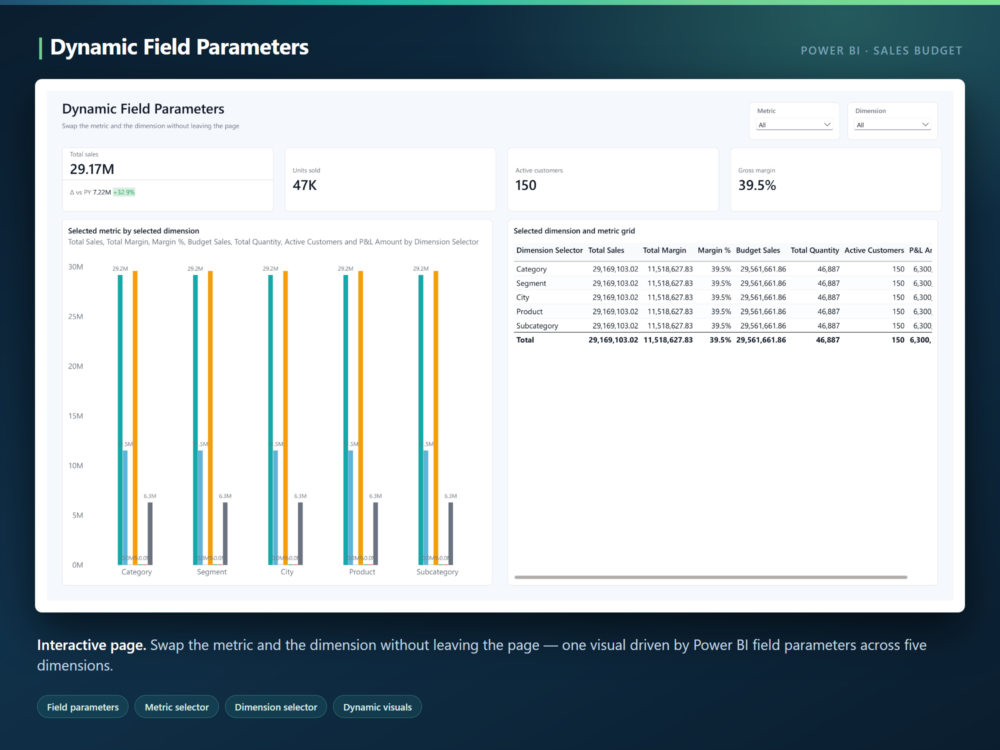

> **"Let me answer my own question."**

One visual, five dimensions and seven metrics, swapped live from two slicers — the chart and grid
both rebuild without leaving the page.

Three field-parameter tables with `NAMEOF(...)` metadata · hidden order columns + `sortByColumn`
for deliberate slicer ordering · explore-any-dimension with zero drillthrough pages

### 10 · Forecast Tracking

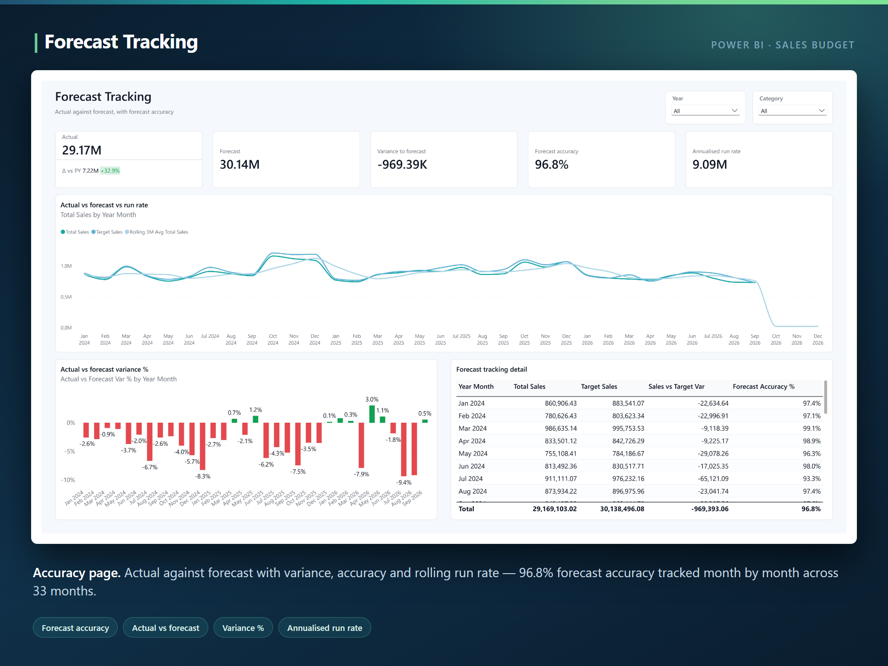

> **"Can we be trusted on the number we promised?"**

Forecast accuracy as the headline — **96.8% accuracy, −969K variance to forecast, 9.09M annualised
run rate** — with actual vs target overlaid against the rolling average, signed monthly
over/under-shoot bars, and a per-month detail table.

Bounded, blank-safe accuracy measure · run rate reusing the anchored rolling window rather than
recomputing it · Base-scenario consistency with the Scenario page

### 11 · Grid & Outlier Detection

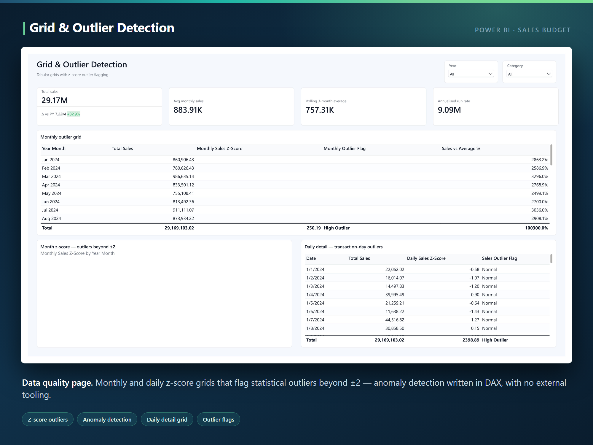

> **"Which periods genuinely broke pattern?"**

Monthly and daily grids scoring every period with a z-score, flagging anything beyond two standard
deviations as a High or Low outlier and showing how far each period sits from the average —
statistics with no external tooling.

Population σ computed in DAX · blank discipline so empty months are empty, not outliers · the same
pattern running at both month and day grain

## 9 · Findings

| Finding | Evidence | So what |
|---|---|---|
| **Plan is close, the mix is not** | −1.3% total; Furniture −2.4%, Technology −2.0%, Office Supplies +0.9% | The headline needs no action; the category split does |
| **Growth is real year over year** | `Total Sales PY` variance **+32.9%** on the landing cards | Prior-year family, not month-over-month, is the honest baseline |
| **Revenue is concentrated** | **15 products carry 80% of sales** | Assortment and promotion decisions target a short list, not a catalogue |
| **The P&L keeps 22.3%** | Net P&L **6.30M** on gross revenue | Common-size column makes the retention rate readable at a glance |
| **The forecast is tight** | **96.8% accuracy**, −969K variance, 9.09M run rate | Planning range is narrow enough to budget against |
| **Outliers are detectable in-model** | z-scores beyond ±2 flagged at month and day grain | No BI-tool dependency — the anomaly logic ships with the model |

**Power BI · Power Query (M) · DAX · TMDL · PBIR**

---

## Running it

**Prerequisites** — Power BI Desktop with *File → Options → Preview features → Power BI Project
(.pbip) save option* enabled. Open `Sales Budget.pbip`.

```
Sales Budget.pbip                 ← open this
Sales Budget.SemanticModel/       TMDL — 14 tables, 11 relationships, 79 measures
Sales Budget.Report/              PBIR — 11 pages, 129 visuals, theme
assets/                           page captures
TOKENS.md                         the design token contract
```

**The data is not committed.** The seven source CSVs are synthetic and regenerate from a Python
script, so the repository ships the model and the report only. Point the model at any folder
containing them by editing one line in
`Sales Budget.SemanticModel/definition/expressions.tmdl`:

```
expression pSeedDataFolder = "C:\path\to\seed_data" meta [IsParameterQuery=true, Type="Text", IsParameterQueryRequired=true]
```

The folder must hold `Dim_Date.csv`, `Dim_Product.csv`, `Dim_Customer.csv`,
`Dim_Financial_Accounts.csv`, `Fact_Sales.csv`, `Fact_Budget.csv` and `Fact_Target.csv`, then run a
full refresh. There are no other hard-coded paths in the model — repointing the whole source is
that one value.

Built by **[harunrhimu](https://github.com/harunrhimu)** · Microsoft Certified: Fabric Analytics
Engineer · Power BI Data Analyst

Open to remote BI and analytics engineering work.
